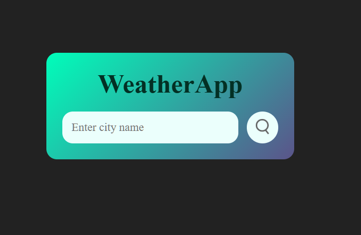
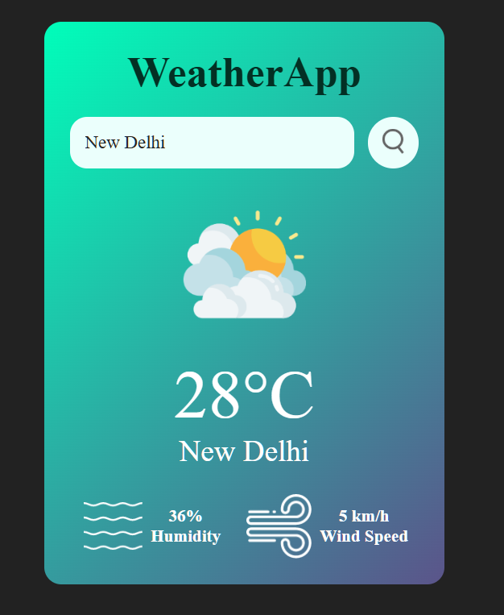

# 🌦️ Weather App

A simple and interactive Weather Application built using HTML, CSS, and JavaScript that fetches real-time weather data using the OpenWeather API.


## 🚀 Features

- 🌍 **Search weather by city name** - Enter any city to get real-time weather data
- 🌡️ **Comprehensive weather data** - View temperature, humidity, and wind speed
- ☁️ **Dynamic visual feedback** - Weather emojis/icons update based on conditions
- 🎵 **Interactive audio** - Click on weather emoji to play matching background sound
- ⚡ **Responsive UI** - Smooth and responsive design across devices

## 🛠️ Tech Stack

- **🧱 HTML** - Semantic markup for structure
- **🎨 CSS** - Styling and responsive design
- **⚙️ JavaScript** - Vanilla JS for interactivity (no frameworks)
- **🌐 OpenWeather API** - Real-time weather data provider

## 📸 Preview




## 📂 Project Structure

```
weather-app/
├── index.html          
├── style.css           
├── script.js           ( Add API key here)
├── project.md          
└── assets/
    ├── images/         # Weather icons 
    └── music/          # Background sounds 
```

## 🔑 Getting Started

Follow these steps to run the project locally:

### 1️⃣ Clone the Repository

```bash
git clone https://github.com/Saksham-Sharma-webdev/weatherApp
cd weather-app
```

### 2️⃣ Get Your OpenWeather API Key

1. Visit [OpenWeather API](https://openweathermap.org/api)
2. Sign up for a free account or log in
3. Generate your API Key from your account dashboard

> **⚠️ Important Note:** OpenWeather may take up to 1 hour to activate your API key for first-time users. If it doesn't work immediately, wait a bit and try again! 😊

### 3️⃣ Add Your API Key

Open `script.js` and replace the placeholder with your actual API key:

```javascript
const apiKey = "YOUR_API_KEY_HERE";
```

### 4️⃣ Run the Project

Simply open `index.html` in your web browser and start searching for weather! 🚀


## ⭐ Support

If you found this project helpful, please consider giving it a star ⭐ on GitHub!

---

**Made with ❤️ using JavaScript 🚀**
